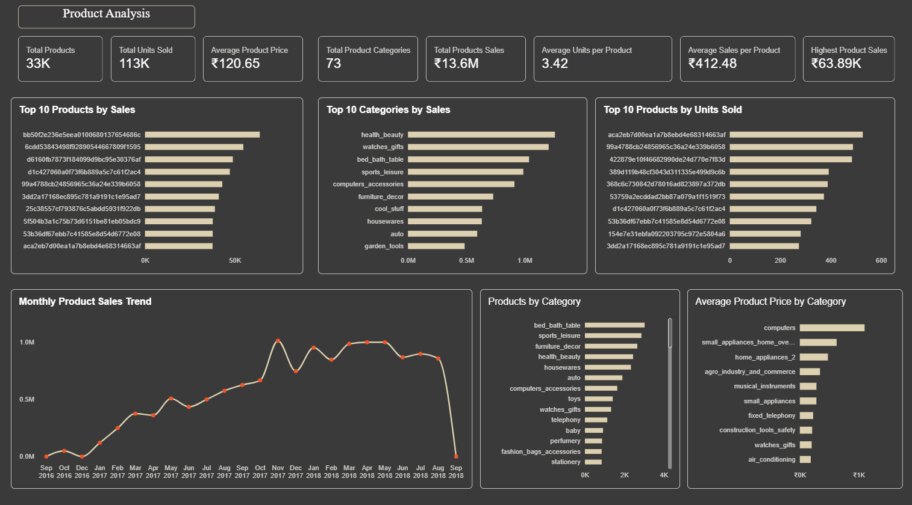
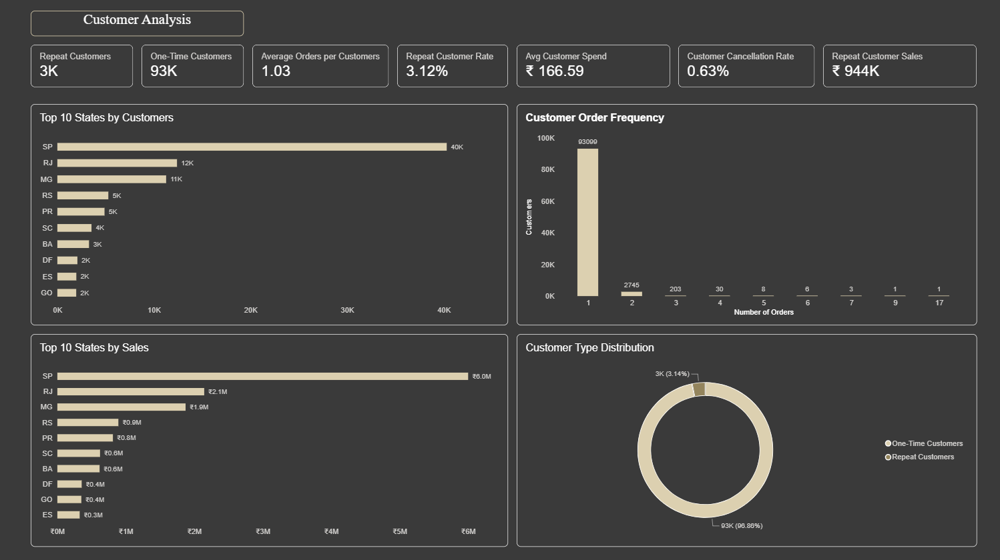

# Olist E-Commerce Analytics

An end-to-end e-commerce analytics portfolio project using the Brazilian Olist public dataset. The project covers data preparation and quality validation in Python, analytical modeling in Power BI, and an interactive dashboard focused on sales, products, customers, and order delivery performance.

## Project Overview

This project analyzes Olist e-commerce data to understand:

- Sales and order performance
- Product and category performance
- Customer purchasing behavior
- Repeat vs one-time customers
- Order and delivery performance
- Late delivery patterns
- Payment methods
- Review scores
- Seller and state-level sales patterns

The goal is to transform transactional data into reliable, business-oriented insights through data cleaning, validation, analysis, and visualization.

## Business Objectives

The project aims to answer questions such as:

1. How are sales and orders performing over time?
2. Which product categories generate the most sales?
3. Which products contribute the most revenue?
4. What is the distribution of one-time and repeat customers?
5. How frequently do customers place orders?
6. Which states have the highest customer and sales contribution?
7. How long does delivery typically take?
8. What percentage of orders are delivered late?
9. How does estimated delivery time compare with actual delivery time?
10. Which payment methods contribute most to sales?

## Project Structure

```text
olist-ecommerce-analytics/
│
├── Python/
│   └── analysis.ipynb
│
├── Olist Project/
│   ├── Data/
│   │   └── Cleaned/
│   │
│   ├── powerbi/
│   │   
│   │
│   └── Images/
│       ├── sales-overview.png
│       ├── product-analysis.png
│       ├── customer-analysis.png
│       └── order-delivery-analysis.png
│
└── README.md
```

## Tools & Technologies

- Python
- Pandas
- Jupyter Notebook
- Power BI
- DAX
- Parquet
- Git
- GitHub

## Data Analysis Workflow

```text
Raw Olist Dataset
        ↓
Data Profiling
        ↓
Data Quality Audit
        ↓
Data Type Conversion
        ↓
Missing Value Investigation
        ↓
Duplicate Detection
        ↓
Data Validation
        ↓
Cleaned Parquet Data
        ↓
Power BI Data Model
        ↓
DAX Measures
        ↓
Interactive Dashboard
```

## Data Preparation & Cleaning

The data preparation process was performed using Python and Pandas.

### Main Steps

- Loaded and profiled the Olist datasets
- Checked dataset dimensions and column types
- Investigated missing values
- Converted date/time columns into appropriate datetime types
- Standardized data types
- Checked duplicate records
- Investigated data-quality inconsistencies
- Validated cleaned datasets
- Exported cleaned datasets in Parquet format

### Data Quality Decisions

Missing values were investigated before deciding whether they should be retained or handled.

Examples:

- Missing delivery dates were retained where they represented valid order-status situations.
- Missing review text was retained because a review can exist without written text.
- Missing product categories were investigated against order-item usage before being retained.
- Missing product dimension fields were retained where the products were still present in transactions.
- Exact duplicate geolocation records were removed during data cleaning.

The objective was to preserve valid business information rather than unnecessarily remove records.

## Data Validation

The final cleaned datasets were validated for:

- Missing values
- Duplicate records
- Data types
- Date fields
- Identifier consistency
- Transaction relationships
- Referential consistency

The cleaned data was stored in Parquet format to preserve data types and schema more reliably for downstream analysis.

## Power BI Data Model

Key relationships in the Power BI model include:

```text
Customers
    │
    └── Orders
          │
          ├── Order Items ── Products
          │                   │
          │                   └── Category Translation
          │
          ├── Payments
          │
          └── Reviews

Order Items ── Sellers

DateTable ── Orders
```

Geolocation data was kept separate because the available zip-code-prefix relationship does not provide a clean relationship suitable for the main analytical model.

# Power BI Dashboard

The dashboard contains four analytical pages.

## 1. Sales Overview

### Key KPIs

- Total Sales
- Total Orders
- Total Customers
- Delivered Orders
- Cancelled Orders
- Average Order Value
- Cancellation Rate
- Average Review Score
- Average Delivery Time

### Visuals

- Orders by Status
- Top 10 Categories by Sales
- Monthly Sales Trend
- Sales by Payment Type
- Review Score Distribution
- Top 10 Sellers by Sales

### Dashboard Preview


---

## 2. Product Analysis

### Key KPIs

- Total Products
- Total Units Sold
- Average Product Price
- Total Product Categories
- Total Product Sales
- Average Units per Product
- Average Sales per Product
- Highest Product Sales

### Visuals

- Top 10 Products by Sales
- Top 10 Categories by Sales
- Monthly Product Sales Trend
- Products by Category
- Top 10 Products by Units Sold
- Top 10 Categories by Average Product Price

### Dashboard Preview



---

## 3. Customer Analysis

### Key KPIs

- Repeat Customers
- One-Time Customers
- Average Orders per Customer
- Repeat Customer Rate
- Average Customer Spend
- Customer Cancellation Rate
- Repeat Customer Sales

### Visuals

- Top 10 States by Customers
- Top 10 States by Sales
- Customer Order Frequency
- Customer Type Distribution

### Dashboard Preview



---

## 4. Order & Delivery Analysis

### Key KPIs

- Delivered Orders
- Average Delivery Time
- Late Delivery Rate
- Average Delivery Delay

### Visuals

- Average Delivery Time Trend
- Monthly Late Delivery Rate
- Orders by Status
- Estimated vs Actual Delivery Time

### Dashboard Preview


## Key DAX Measures

The dashboard uses DAX measures for business metrics such as:

- Total Sales
- Total Orders
- Total Customers
- Delivered Orders
- Cancelled Orders
- Average Order Value
- Cancellation Rate
- Average Review Score
- Average Delivery Time
- Repeat Customers
- One-Time Customers
- Repeat Customer Rate
- Average Customer Spend
- Late Delivery Rate
- Average Delivery Delay
- Product Sales
- Units Sold

These measures allow the dashboard to respond dynamically to filters and date selections.

## Key Analytical Areas

### Sales
- Revenue trends
- Order volume
- Payment methods
- Cancellation patterns

### Products
- Product sales
- Category performance
- Units sold
- Product pricing

### Customers
- Customer frequency
- Repeat purchasing
- Customer spending
- State-level distribution

### Delivery
- Delivery duration
- Estimated vs actual delivery
- Late delivery rate
- Order status

## Skills Demonstrated

- Data Cleaning
- Data Profiling
- Exploratory Data Analysis
- Data Quality Validation
- Python
- Pandas
- Jupyter Notebook
- Power BI
- DAX
- Data Modeling
- KPI Development
- Business Analytics
- Data Visualization
- Analytical Storytelling
- Git/GitHub

## Project Files

| File / Folder | Purpose |
|---|---|
| `Python/analysis.ipynb` | Python-based data analysis and preparation |
| `Olist_Project/Data/Cleaned/` | Cleaned analytical datasets |
| `Olist_Project/powerbi/` | Power BI dashboard files|
| `Olist_Project/images/` | Dashboard screenshots |
| `README.md` | Project documentation |

## Power BI Dashboard

The interactive Power BI dashboard was developed as part of this project.

Dashboard previews are available in the `Olist_Project/images/` folder.

## Data Note

This project uses the publicly available Brazilian Olist e-commerce dataset.

The original raw datasets are not included in this repository. The repository focuses on the analytical workflow, cleaned data, Python analysis, Power BI dashboard, and project documentation.


## Author

**Suraj Kumar**  
Aspiring Data Analyst | Data Science Fresher

GitHub: `Surajflow`
